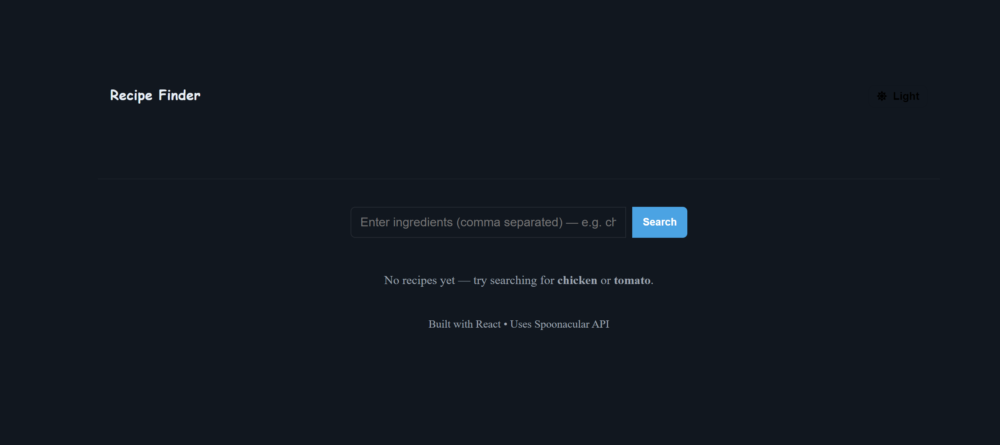

Recipe Finder

A React application to search for recipes by ingredients with a dark/light mode toggle. It fetches recipes from the Spoonacular API and displays them in a responsive grid with detailed recipe information.

🚀 Features

Search recipes by entering one or more ingredients (comma-separated)

Responsive grid layout for recipe cards

Light and dark theme toggle with persisted preference

Click on a recipe to see details: ingredients, instructions, servings, ready time

API integration using Axios and Spoonacular API

📸 Screenshot

💻 Getting Started
Prerequisites

Node.js installed (v16 or newer recommended)

Spoonacular API key (Sign up here
)

Installation

Clone the repository:

git clone https://github.com/yourusername/recipe-finder.git
cd recipe-finder

Install dependencies:

npm install

Create a .env.local file in the project root and add your API key:

REACT_APP_SPOONACULAR_KEY=your_api_key_here

Start the development server:

npm start

The app should open automatically at http://localhost:3000.

⚡ Usage

Enter ingredients in the search bar (e.g., chicken, tomato).

Click Search or press Enter.

Browse the recipe cards in the grid.

Click a card to view detailed recipe information in a modal.

Toggle between light and dark themes using the top-right button.

🛠 Tech Stack

React for building the UI

Axios for API requests

React Icons for theme toggle icons

CSS for styling and responsive design

📁 Project Structure
recipe-finder/
├─ src/
│  ├─ api.js              # Spoonacular API calls
│  ├─ components/
│  │  ├─ RecipeCard.jsx
│  │  ├─ RecipeModal.jsx
│  │  └─ ThemeToggle.jsx
│  ├─ context/
│  │  └─ ThemeContext.jsx
│  ├─ pages/
│  │  └─ Home.jsx
│  ├─ App.jsx
│  └─ index.js
├─ .env.local             # Your API key (ignored by git)
├─ package.json
└─ README.md
